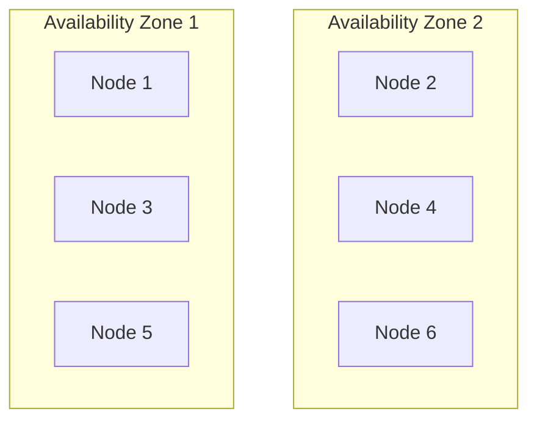
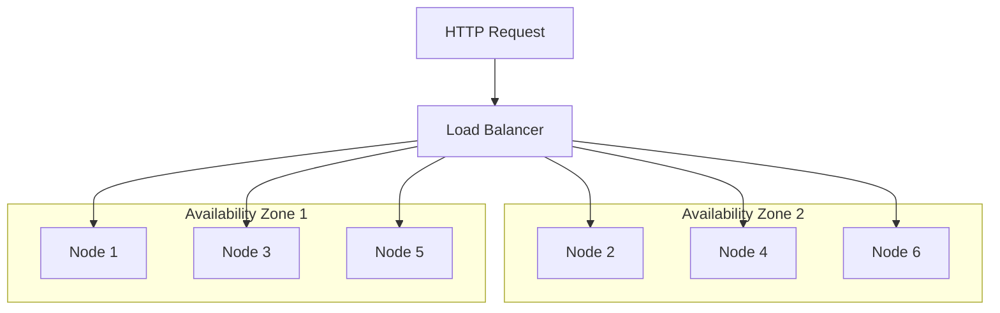

# High availability

Magento / Adobe Commerce availability depends on the availability of all it's external services (database, cache, search, etc.), and the underlying infrastructure (Kubernetes cluster, nodes, etc.).

High availability is the ability of a system to remain operational even when some of its components fail.

In this page, we will cover all the aspects of high availability for Magento / Adobe Commerce on Kubernetes.

> [!NOTE]
> In the below explanations, we will be considering that your Kubernetes cluster is deployed on a cloud provider (AWS, GCP, Azure, etc.), and that it's managed by the cloud provider (EKS, GKE, AKS, etc.).

## Kubernetes Cluster and Nodes

The first step to ensure high availability is to have a highly available Kubernetes cluster.

A highly available Kubernetes cluster is a cluster that can tolerate the failure of one or more nodes, and still remain operational.

To achieve this, you need to deploy your Kubernetes cluster across multiple availability zones (AZs), and have at least one master node in each AZ.

This way, if one AZ goes down, the other AZs can take over the workload.

Furthermore, you should have **at least 2 nodes in each AZ**, to ensure that the cluster can still operate if one node goes down, or during an upgrade.

## Load Balancing

Kubernetes Services act as a round-robin load balancer for the Pods of a Deployment.

When a Pod goes down (not ready), the `Service` will automatically redirect the traffic to another `Pod`.

Concerning the trafic coming from the Internet, you should use a cloud provider's Load Balancer (layer 7 or layer 4) to distribute the traffic across the nodes of your Kubernetes cluster (see [the architecture page](/guide/deployment/architecture#networking)).

Using a Load Balancer both helps distribute the traffic across the nodes, and ensures that the traffic is redirected to the healthy nodes, to ensure high availability.

## Web server Pods

As mentioned in the [resources and scaling page](/guide/deployment/resources-scaling##workload-placement), `Pods` should be distributed across the nodes and AZs of the Kubernetes cluster.

Additionally, we should define:

* A `PodDisruptionBudget` to ensure that at least a given number of `Pods` is available at all times
* A readiness and liveness probe to ensure that the `Pod` is healthy and ready to receive traffic, and to restart it if needed (stale)

> [!IMPORTANT]
> When defining a readiness probe for your PHP FPM container, you shouldn't rely Magento's `health_check.php` endpoint, as it depends on external services to be available.

## Database (MySQL)

## Cache (Redis)

## Search (Elasticsearch / OpenSearch)
