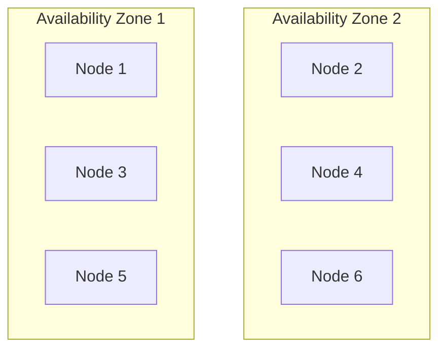
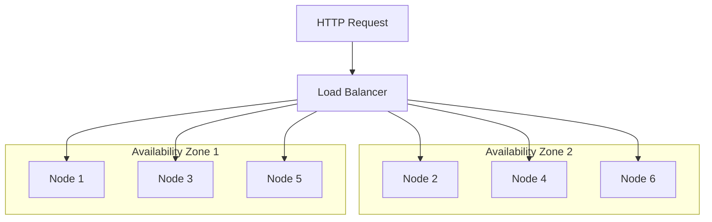
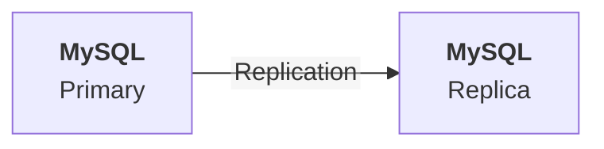
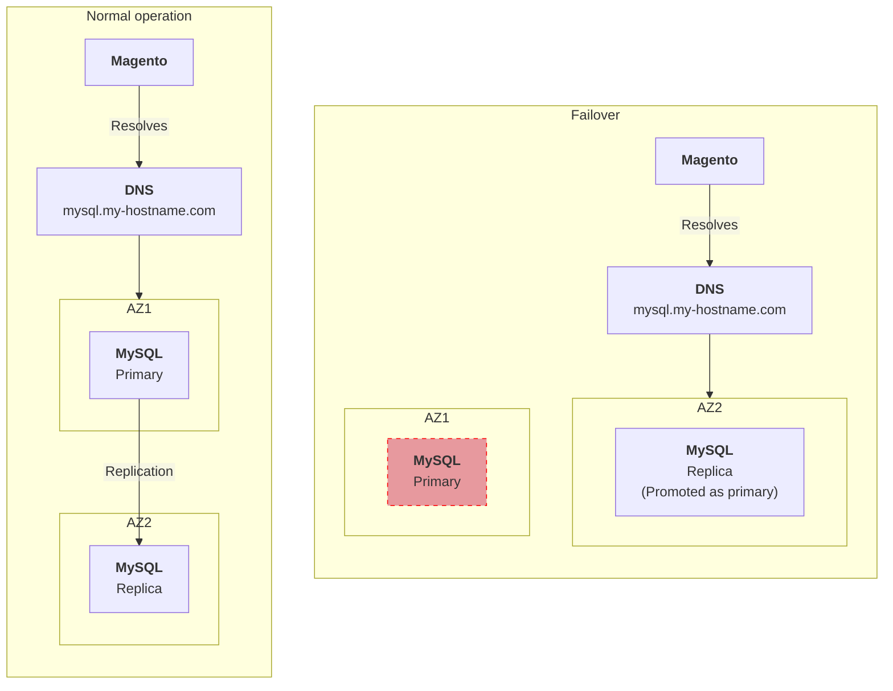

# High availability

Magento / Adobe Commerce availability depends on the availability of all it's external services (database, cache, search, etc.), and the underlying infrastructure (Kubernetes cluster, nodes, etc.).

High availability is the ability of a system to remain operational even when some of its components fail.

In this page, we will cover all the aspects of high availability for Magento / Adobe Commerce on Kubernetes.

> [!NOTE]
> In the below explanations, we will be considering that your Kubernetes cluster is deployed on a cloud provider (AWS, GCP, Azure, etc.), and that it's managed by the cloud provider (EKS, GKE, AKS, etc.).

## Kubernetes Cluster and Nodes

The first step to ensure high availability is to have a highly available Kubernetes cluster.

A highly available Kubernetes cluster is a cluster that can tolerate the failure of one or more nodes, and still remain operational.

To achieve this, you need to deploy your Kubernetes cluster across multiple availability zones (AZs), and have at least one master node in each AZ.

This way, if one AZ goes down, the other AZs can take over the workload.



Furthermore, you should have **at least 2 nodes in each AZ**, to ensure that the cluster can still operate if one node goes down, or during an upgrade.

## Load Balancing

Kubernetes Services act as a round-robin load balancer for the Pods of a Deployment.

When a Pod goes down (not ready), the `Service` will automatically redirect the traffic to another `Pod`.

Concerning the trafic coming from the Internet, you should use a cloud provider's Load Balancer (layer 7 or layer 4) to distribute the traffic across the nodes of your Kubernetes cluster (see [the architecture page](/guide/deployment/architecture#networking)).



Using a Load Balancer both helps distribute the traffic across the nodes, and ensures that the traffic is redirected to the healthy nodes, to ensure high availability.

## Web server Pods

As mentioned in the [resources and scaling page](/guide/deployment/resources-scaling##workload-placement), `Pods` should be distributed across the nodes and AZs of the Kubernetes cluster.

Additionally, we should:

* Define a `PodDisruptionBudget` to ensure that at least a given number of `Pods` is available at all times
* Define a readiness and liveness probe to ensure that the `Pod` is healthy and ready to receive traffic, and to restart it if needed (stale)
* Make sure containers are terminated gracefully, to avoid data loss

### Readiness and liveness probes

> [!IMPORTANT]
> When defining a readiness probe for your PHP FPM container, you shouldn't rely Magento's `health_check.php` endpoint, as it depends on external services availability (database, cache, etc.).

The following options can be used to define a readiness and liveness probe for the containers:

* `nginx` container: use a `httpGet` probe on the `/nginx-health` endpoint we defined in the vhost
* `php-fpm` container:
  * Use a `tcpSocket` probe on the port 9000 (PHP-FPM listens on this port)
  * Use an `exec` probe to run a PHP script (similar to `health_check.php`), without relying on external services

### Graceful termination

When a `Pod` is terminated, Kubernetes sends a `SIGTERM` signal to the main process of the container, and waits for a grace period (30 seconds by default) before sending a `SIGKILL` signal to force the container to stop.

To make sure that our `nginx` container finishes serving all the requests before being terminated, we can define a `preStop` command in the `Deployment` manifest:

```yaml{13-16}
apiVersion: apps/v1
kind: Deployment
metadata:
  name: magento-deployment
spec:
  ...
  template:
    ...
    spec:
      containers:
        - name: nginx
          ...
          lifecycle:
            preStop:
              exec:
                command: ["/bin/sh", "-c", "sleep 3; nginx -s quit; while killall -0 nginx; do sleep 1; done"]
          ...
```

Defining such a pre-stop command will make sure that the `SIGTERM` signal is sent to the containers only once all the requests are served.

> [!TIP]
> If for some (good) reason you need to handle some requests during more than 30 seconds, you can increase the grace period by setting the `terminationGracePeriodSeconds` property in the `Deployment` manifest.

## Database (MySQL)

High availability for MySQL can _almost_ be achieved by using a primary-replica replication, with automatic failover:



Practically speaking, automatic failover is rarely achieved, as it requires to be regularly tested, and to define a proper failover strategy: how is failover decided? how is the new primary elected? how is the traffic redirected to the new primary?

Using a cloud provider's managed database service (RDS, Cloud SQL, etc.) reduces the risk of unavailability, compared to a self-managed database.

Anyway, it is a best practice to have a read-replica for your database:

* To have a replica in another Availability Zone
* To have a backup in case the primary goes down
* To offload read queries from the primary (although Magento / Adobe Commerce is mostly write-heavy), for instance for reporting purposes

To avoid requiring change in your application config when the primary goes down, you can rely on a DNS-based failover solution:



> [!TIP]
> [Amazon Aurora DB Clusters](https://docs.aws.amazon.com/AmazonRDS/latest/AuroraUserGuide/Aurora.Overview.html) offer a managed database service with automatic failover (using a single DNS record), read-replicas, and more.

## Cache (Redis)

Achieving high availability for Redis is quite simple:

* Using Redis cluster, with instances distributed across multiple AZs
* Using Redis standalone nodes in multiple AZs, with a DNS-based failover solution

As Magento / Adobe Commerce only stores cache in Redis (no persistent data), it is totally safe to use a DNS-based failover solution for Redis, without requiring any replication.

## Search (Elasticsearch / OpenSearch)

High availability for Elasticsearch / OpenSearch can be achieved by using a cluster with multiple nodes, distributed across multiple AZs.

> [!NOTE]
> Magento / Adobe Commerce only allows specifying one Elasticsearch / OpenSearch endpoint in the configuration, so you should have some sort of load balancer in front of your Elasticsearch / OpenSearch cluster, or use a DNS-based failover solution.

## Wrapping up

High availability is a complex topic, and requires to take into account from the early stages of the project, including when developping modules:

* How to handle and recover from failures?
* How to ensure that the system remains operational?
* How to test the high availability of the system?
* How to monitor the system?
