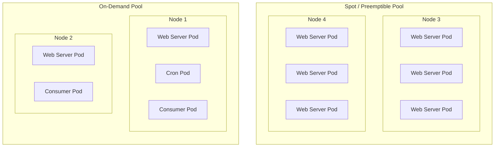

# Spot and preemptible instances

Running Magento / Adobe Commerce on spot or preemptible instances can save you a lot of money, especially if you have a large number of instances.

Spot (AWS) and preemptible (GCP) instances are spare compute instances that are available at a lower price than on-demand instances. The price of spot instances fluctuates based on supply and demand, usually between 50% and 90% off the on-demand price.

There are however some caveats to using spot and preemptible instances:

* Spot and preemptible instances can be terminated at any time by the cloud provider, with a 2-minute warning
* Spot and preemptible instances may not be available when you need them, especially during peak times

## Termination handling

When using spot or preemptible instances, you should have a strategy to handle the termination of instances.

Ours recommendations are the following:

* Only run web server `Pods` on spot or preemptible instances, or non-critical workloads (like consumers or batch jobs that support restarts)
* Make sure that your `Pods` are able to handle the termination of instances gracefully (see [graceful termination](/guide/advanced/high-availability.html#graceful-termination))
* Keep a buffer of on-demand instances (2 minimum) to handle the termination of spot or preemptible instances

> [!NOTE]
> Amazon EKS requires an additional component to handle the termination of spot instances: the [Amazon Node Termination Handler](https://github.com/aws/aws-node-termination-handler).

> [!TIP]
> You may be running your **entire non-production cluster on spot or preemptible instances**, and only have on-demand instances for production. 
> Additionally, consider using [kube-downscaler](https://codeberg.org/hjacobs/kube-downscaler) to automatically scale down / shut down unused non-production workloads, i.e. during the night and weekends.

## Instance types

When using spot or preemptible instances, you should use instance types that are less likely to be terminated.

You should also allow multiple instance types in your node group / node pool configuration, to ensure that the cluster can still operate if one instance type is not available.

For example, you could use a mix of `m6.large`, `m6.xlarge`, and `m6.2xlarge` instances in your node group configuration.

To optimize the instance type selection, you can use [Karpenter](https://karpenter.sh/), with which you can define advanced instance type selection strategies based on the instance type availability and pricing. Karpenter even allows falling back to on-demand instances if no spot instances are available.
