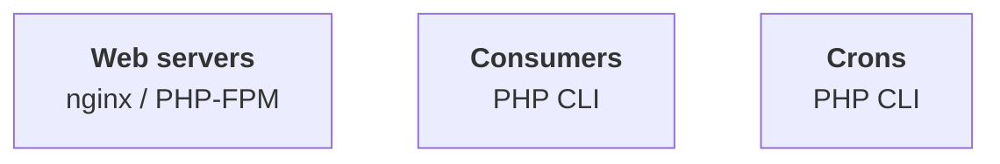
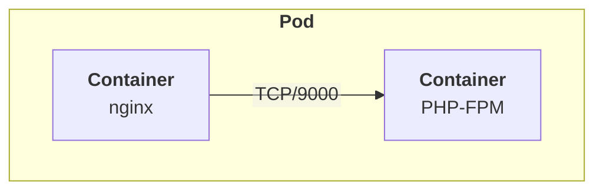
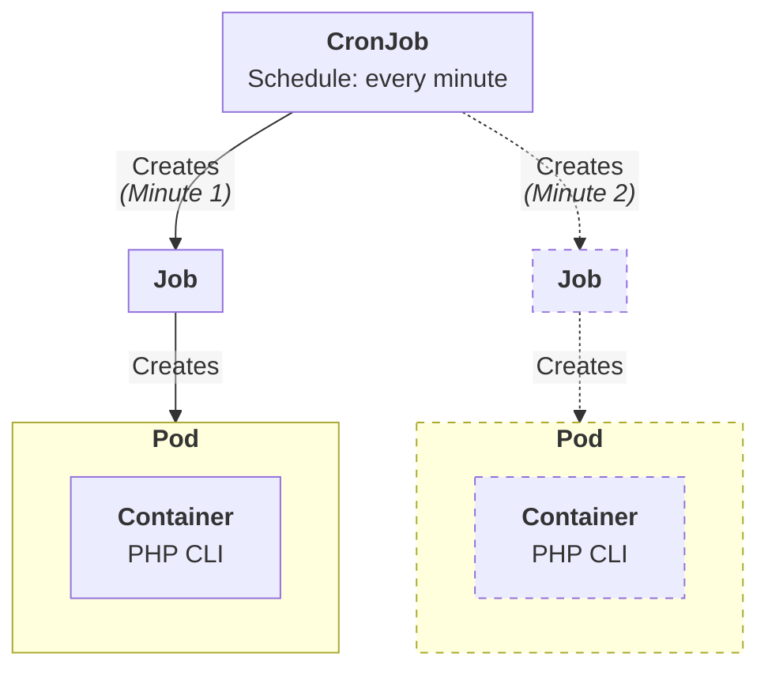
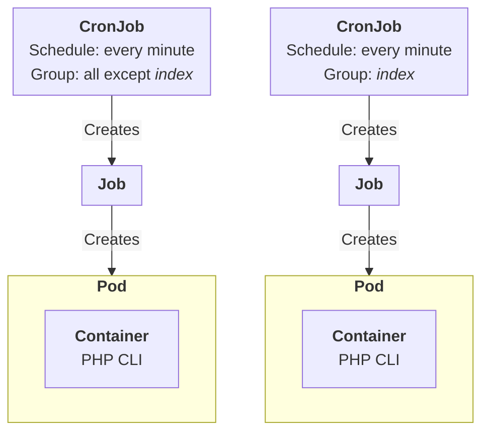
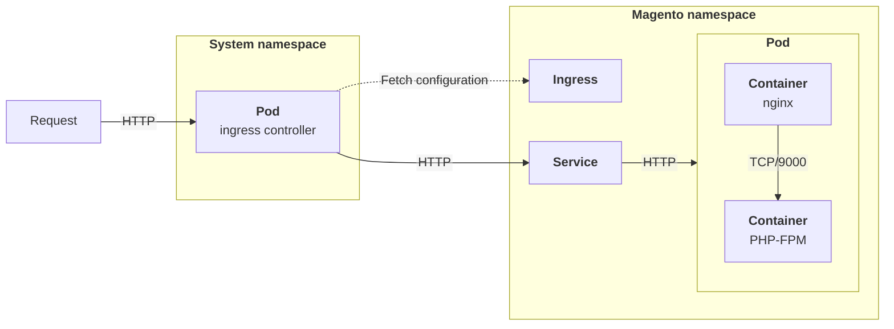
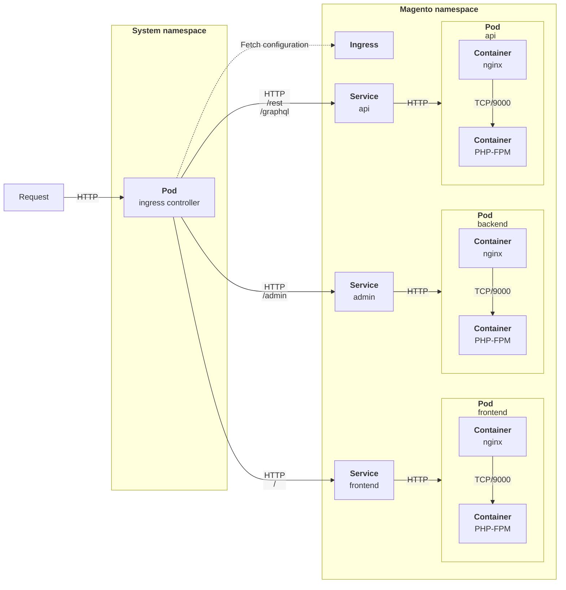
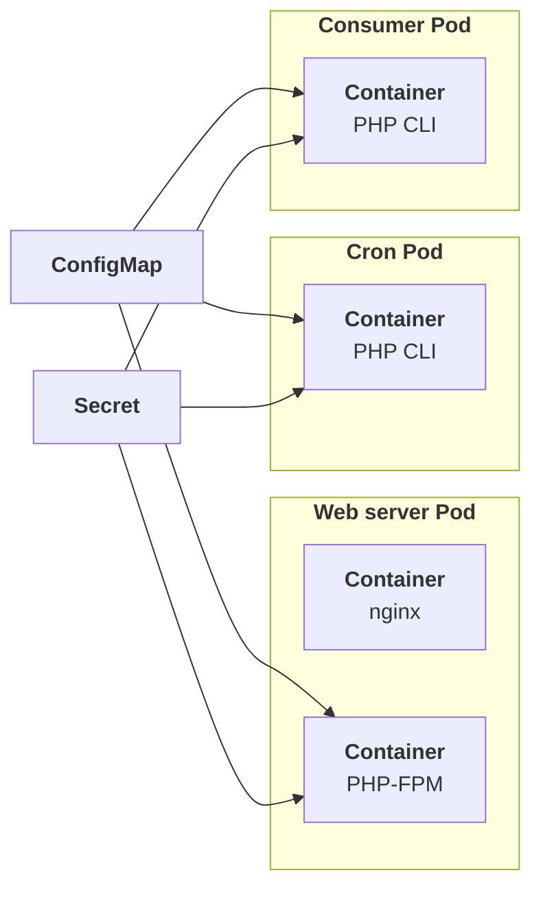

# Architecture

Magento / Adobe Commerce consists of three main components that work together:

We will be using the following Kubernetes main resources:

* **Web servers**: `Deployments`, `HorizontalPodAutoscalers` and `Services`
* **Consumers**: `Deployments` with 1 replica per consumer
* **Crons**: `CronJobs`

Additionally, we will also be using the following resources:

* `ConfigMaps`: to store environment variables
* `Secrets`: to store sensitive environment variables
* `PersisventVolumes` / `PersistentVolumeClaims`: to store persistent data (cache, media, etc.) and share it between pods

## Components

### Web servers

Web servers are the main entry point for the application. They are responsible for serving the web pages to the users.

The `Pods` will have two containers:

> [!IMPORTANT]
> `Deployments` processing web traffic should always have at least 2 replicas, to ensure service availability (i.e. during upgrades) but also to make sure that the application is ready to scale horizontally if needed.
> In a production deployment, this will be handled using a `HorizontalPodAutoscaler`.

### Consumers

Consumers are responsible for processing messages from the message queue (RabbitMQ or MySQL). They are long-running processes that will be running in the background.

One `Deployment` needs to be created for each consumer, each containing a single PHP CLI container.

> [!IMPORTANT]
> At the time of writing, Magento / Adobe Commerce does not handle UNIX signals properly, which means that the containers will not be able to handle graceful shutdowns.
> Therefore, the `Pods` will be terminated immediately, without giving the application time to finish processing the current message.

At the time of writing, the following consumers are available:

* `saveConfigProcessor`
* `product_action_attribute.update`
* `product_action_attribute.website.update`
* `catalog_website_attribute_value_sync`
* `media.storage.catalog.image.resize`
* `exportProcessor`
* `inventory.source.items.cleanup`
* `inventory.mass.update`
* `inventory.reservations.cleanup`
* `inventory.reservations.update`
* `inventory.reservations.updateSalabilityStatus`
* `inventory.indexer.sourceItem`
* `inventory.indexer.stock`
* `media.content.synchronization`
* `media.gallery.renditions.update`
* `media.gallery.synchronization`
* `codegeneratorProcessor`
* `sales.rule.update.coupon.usage`
* `sales.rule.quote.trigger.recollect`
* `product_alert`
* `async.operations.all`

You might not need tu run all the consumers, depending on your use case.

> [!INFO]
> Although it is not the recommended way to run the consumers in Kubernetes, you can use the `consumers_runner` cron (in `consumers` group) to run all the consumers specified in `cron_consumers_runner/cron_run` in `env.php`. 
> An interesting option would be having individual `Deployments` for critical / time-sensitive consumers, and using the `consumers_runner` cron for the rest.

### Crons

Crons are responsible for running scheduled tasks. They are short-lived processes that will be running at specific intervals.

One `CronJob` will be used to run the crons, with a single PHP CLI container.

The `CronJob` will create a new `Job` every minute, which will create a new `Pod` with a PHP CLI container.

As we need to allow concurrent executions of the same cron, to avoid leaving jobs unprocessed (i.e. during reindexing), new `Jobs` and their `Pods` might spin up before the previous ones have finished.

> [!WARNING]
> Allowing concurrent executions of the same cron might lead to have many `Pods` running at the same time, which might lead to performance issues.
> This should be monitored and adjusted as needed.

#### Using cron groups

To avoid having too many `Pods` running at the same time, you can use cron groups to trigger the cron jobs.

The Magento / Adobe Commerce `cron:run` command supports the two following options:

* `--group`: to run only the cron jobs that belong to the specified group
* `--exclude-group`: to run all the cron jobs except the ones that belong to the specified group

You can use these options to create cron groups and run the cron jobs in a more controlled way.

At the time of writing, the following cron groups are available:

* `consumers`
* `default`
* `index`
* `payment_services_data_export`
* `payment_services_order_sync`

For instance, you might want to create one `CronJob` for the `index` group, and another one for all the other groups by excluding the `index` one:

## Networking

Two main networking configurations are possible for web servers:

* Using a Kubernetes **Ingress** with an Ingress Controller, to route the traffic to the web servers
* Using a cloud provider's layer 7 **Load Balancer** (i.e. AWS Application Load Balancer), to route the traffic to the web servers, within the VPC

We'll focus on the Ingress configuration, as it is the most common way to route the traffic to the web servers.

We will be using the [nginx ingress controller](https://kubernetes.github.io/ingress-nginx/), which is the most popular Ingress controller for Kubernetes.

> [!NOTE]
> Although this may a bit of a duplicate, an Ingress controller can totally be placed behind a layer 7 Load Balancer.

## Splitting workloads

Although sharing the same database between the web servers is required, you might want to split the web server worloads, for instance when:

* You want to split the frontend, admin and API workloads, to avoid having one part of the application slowing down the others
* You have different resource requirements for each workload (CPU, memory, capacity type, etc.)

Splitting the web server workloads can be achieved by using a different `Deployment` for each workload, with its own `HorizontalPodAutoscaler` and `Service`.

Then, you can use configure prefixes in your `Ingress` to route the traffic to the correct `Service`.

## Shared storage

Magento / Adobe Commerce requires storage to store persistent data at runtime (cache, media, etc.) and share it between Pods.

The following directories might need to be shared between Pods:

| Directory           | Description                          | Required                        |
|---------------------|--------------------------------------|---------------------------------|
| `pub/media`         | Media files                          | :heavy_check_mark: 1 |
| `pub/static/_cache` | Static files cache (i.e. merged CSS) | If merge is enabled             |
| `var`               | Cache, logs, reports, sessions, etc. | :heavy_check_mark: 2 |

> 1 : The content of the `pub/media` directory might be stored in an external storage (i.e. S3, GCS, etc.), which would allow to avoid sharing the directory between pods.
> 
> 2 : Cache and sessions should be stored in Redis. Logs can be shared to facilitate cross-pod debugging, but may have simultaneous write issues. We'll see further how to get logs printed to standard output of Pods.

If you decide to share the directories between `Pods`, you will need to use `PersistentVolumes` and `PersistentVolumeClaims` with a `ReadWriteMany` compatible `StorageClass`.

> [!INFO]
> Few `ReadWriteMany` storage classes options are available for Kubernetes, you should rely on the one provided by your cloud provider (i.e. AWS EFS, GCP Filestore, Azure Files, etc.), which is most of the time NFS-based.

> [!TIP]
> You should avoid as much as possible sharing directories between `Pods` (and more generally persisting data to disk), as it might lead to performance issues and data corruption. 
> Prefer, whenever possible, using external object storage solutions (i.e. S3, GCS, etc.) to store persistent data.

## Configuration and secrets

Configuration and secrets should be stored in `ConfigMaps` and `Secrets` respectively.

We will be using those to store our environment variables, and _mount_ them in the Pods containers.

