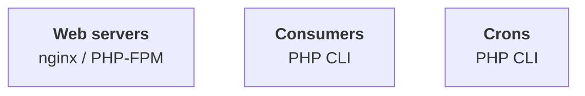
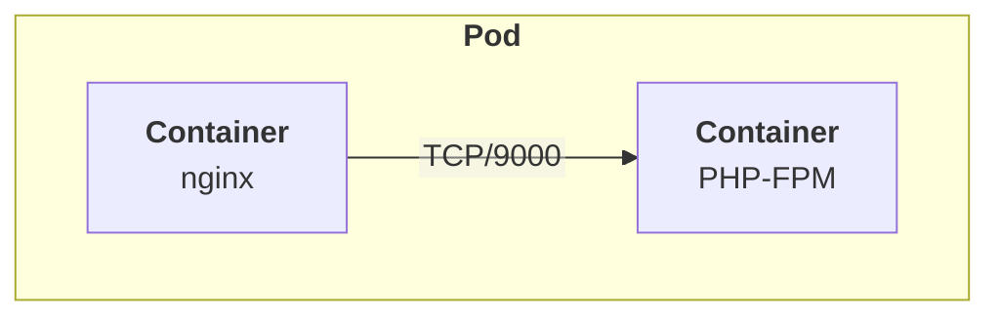
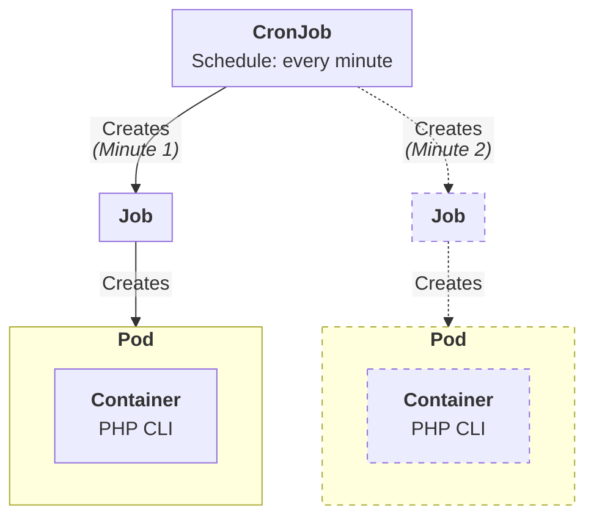

# Architecture

Magento / Adobe Commerce consists of three main components that work together:

We will be using the following Kubernetes main resources:

* **Web servers**: `Deployments`, `HorizontalPodAutoscalers` and `Services`
* **Consumers**: `Deployments` with 1 replica per consumer
* **Crons**: `CronJobs`

Additionally, we will also be using the following resources:

* **ConfigMaps**: to store environment variables
* **Secrets**: to store sensitive environment variables
* **PersisventVolumes** / **PersistentVolumeClaims**: to store persistent data (media, etc.) and share it between pods

## Components

### Web servers

Web servers are the main entry point for the application. They are responsible for serving the web pages to the users.

The `Pods` will have two containers:

> [!IMPORTANT]
> `Deployments` processing web traffic should always have at least 2 replicas, to ensure service availability (i.e. during upgrades) but also to make sure that the application is ready to scale horizontally if needed.
> In a production deployment, this will be handled using a `HorizontalPodAutoscaler`.

### Consumers

Consumers are responsible for processing messages from the message queue (RabbitMQ or MySQL). They are long-running processes that will be running in the background.

One `Deployment` needs to be created for each consumer, each containing a single PHP CLI container.

> [!IMPORTANT]
> At the time of writing, Magento / Adobe Commerce does not handle UNIX signals properly, which means that the containers will not be able to handle graceful shutdowns.
> Therefore, the `Pods` will be terminated immediately, without giving the application time to finish processing the current message.

TODO: fork handling (standalone process)?

### Crons

Crons are responsible for running scheduled tasks. They are short-lived processes that will be running at specific intervals.

One `CronJob` will be used to run the crons, with a single PHP CLI container.

The `CronJob` will create a new `Job` every minute, which will create a new `Pod` with a PHP CLI container.

As we need to allow concurrent executions of the same cron, to avoid leaving jobs unprocessed (i.e. during reindexing), new `Jobs` and their `Pods` might spin up before the previous ones have finished.

> [!WARNING]
> Allowing concurrent executions of the same cron might lead to have many `Pods` running at the same time, which might lead to performance issues.
> This should be monitored and adjusted as needed.

TODO: cron groups
