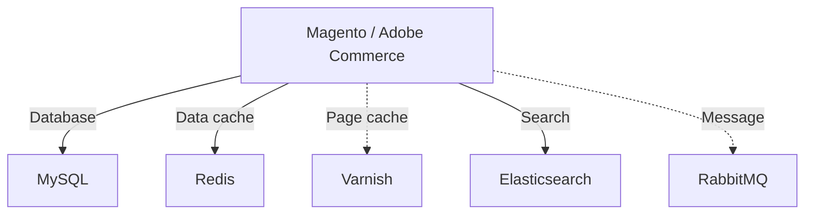

# External services

Magento / Adobe Commerce relies on several external services to function properly.

The following versions are currently supported by Magento / Adobe Commerce 2.4.7:

| Category   | Service                   | Version | Type       | Required             |
|------------|---------------------------|---------|------------|----------------------|
| Database   | MySQL                     | 8.0     | On premise | :heavy_check_mark: * |
| Database   | MariaDB                   | 10.6    | On premise | :heavy_check_mark: * |
| Database   | AWS Aurora MySQL          | 8.0     | Managed    | :heavy_check_mark: * |
| Data cache | Redis                     | 7.0     | On premise | :heavy_check_mark: * |
| Data cache | AWS Elasticache for Redis | 7.0     | Managed    | :heavy_check_mark: * |
| Page cache | Varnish                   | 7.5     | On premise |                      |
| Search     | Elasticsearch             | 8.11    | On premise | :heavy_check_mark: * |
| Search     | OpenSearch                | 2.12    | On premise | :heavy_check_mark: * |
| Search     | AWS OpenSearch            | 2.11    | Managed    | :heavy_check_mark: * |
| Message    | RabbitMQ                  | 3.13    | On premise |                      |
| Message    | AWS MQ                    | 3.11.20 | Managed    |                      |

> _\* : one database, one data cache, and one search service are required_

An up-to-date list of supported versions can be found in the [official documentation](https://experienceleague.adobe.com/en/docs/commerce-operations/installation-guide/system-requirements), under `Commerce on-premises` tab.

> [!INFO]
> Whenever possible, we recommend using managed services for databases, caches, and message queues. Managed services are easier to maintain and scale, and they often come with built-in monitoring and backup solutions.
> Although Adobe only officially supports AWS managed services, **you can use other cloud providers as well**, as long as the service versions are compatible with Magento / Adobe Commerce.
