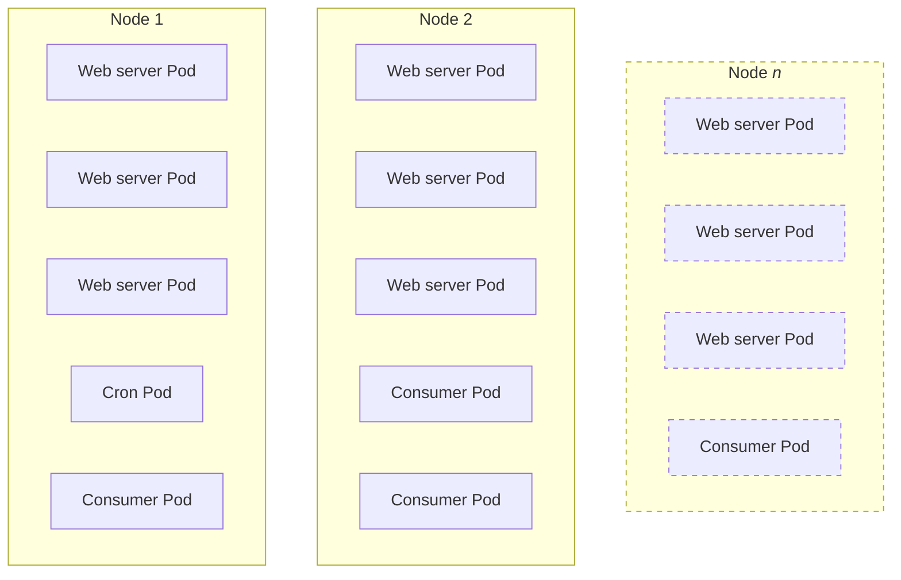

# Resources and scaling

In Kubernetes, resources like CPU and memory are crucial for workload allocation on Nodes.
Pods have resource requests and limits, which help the scheduler decide where to place them.
Proper provisioning ensures efficient resource use and system stability.

Choosing the right resource requests for workloads in Kubernetes is challenging due to the need to balance application performance with efficient resource utilization (over vs. under provisioning).

> [!TIP]
> If you're not familiar with Kubernetes resources, check out the [How Pods with resource requests are scheduled](https://kubernetes.io/docs/concepts/configuration/manage-resources-containers/#how-pods-with-resource-requests-are-scheduled) section in the official Kubernetes documentation.

Additionally, horizontal scaling is a critical aspect of managing workloads in Kubernetes: it allows you to scale the number of Pods based on resource usage or other metrics.
It is preferable to have smaller Pods, which can be easily scaled horizontally, and facilitate better resource utilization on Nodes.

## Resource allocation

### Web server Pods

When building our PHP FPM Docker image, we fixed the number of PHP-FPM workers to **10** (see [this section](/guide/build/docker#fpm-config)).

This means that _theoretically_, each PHP-FPM worker can consume up to 1 CPU core, and the total CPU usage of all PHP-FPM workers in 1 Pod can reach 10 CPU cores.

However, in practice, PHP-FPM workers are not always using CPU when handling requests: they can be waiting for I/O operations, network requests, etc.

Depending on your specific workload, the actual user CPU usage duration varies between 20% and 80% of the total time taken by the worker to handle a request.

Our general recommentation of resources for the web servers Pods containers is:

| Container | Resource | Request | Limit          |
|-----------|----------|---------|----------------|
| PHP-FPM   | CPU      | 2       | 2 <sup>1</sup> |
| PHP-FPM   | Memory   | 2Gi     | 2Gi            |
| nginx     | CPU      | 0.2     |                |
| nginx     | Memory   | 256Mi   | 256Mi          |

> <sup>1</sup> : setting CPU limits is often not recommended as it may cause contention and performance degradation. Setting such a limit may not be useful with properly configured horizontal autoscaling.

> [!IMPORTANT]
> Requesting the proper amount of memory is more critical than CPU: if a Node runs out of memory, it can become unresponsive, and the Pod can be evicted. Also, when the memory limit of a Pods container is reached, the container is killed.
> CPU throttling is less critical, as the Pod can still run, but it will be slower.

> [!TIP]
> Although we're using round numbers for resource requests, you might want to fine-tune those values depending on your nodes capacity: an 8-core Node will actually have around 7 CPU cores available for Pods, as between 0.5 and 1 core is used for system processes and `DaemonSets`.

### Consumer and cron Pods

The consumer and cron Pods are running a single process, meaning that they can not use more than 1 CPU core.

Our general recommendation of resources for the consumer and cron Pods containers is:

| Type     | Resource | Request | Limit |
|----------|----------|---------|-------|
| Consumer | CPU      | 0.2     |       |
| Consumer | Memory   | 1Gi     | 1Gi   |
| Cron     | CPU      | 0.5     |       |
| Cron     | Memory   | 1Gi     | 1Gi   |

The CPU resources to request may differ between cron groups (if running separately) and between the different consumers.

For instance, the `index` cron group has smaller CPU requirements, as it's mainly working with I/O operations (database, search, etc.).

### Wrapping up

Allocating resources to Pods is a complex task, and may require some trial and error to find the right balance between performance and resource utilization.

You should monitor your Pods and Nodes (i.e. using Prometheus, see further in this guide) to ensure that the resources allocated are adapted to the workload, and adjust them if needed.

## Workload placement

When deploying Pods in a Kubernetes cluster, the scheduler decides where to place them based on the resource requests and limits of the Pods, as well as the available resources on the Nodes.

<!-- Schema of "Web server Pods" being placed in different Kubernetes nodes  -->


But it also takes into account other factors, such as the Pod's affinity and anti-affinity rules, taints and tolerations, etc.

As a general rule, you should avoid placing all the `Pods` of a same `Deployment` on the same Node, to ensure high availability in case of Node failure.

Such a rule can be enforced using Pod anti-affinity rules, which prevent Pods with the same label to be scheduled on the same Node:

```yaml
apiVersion: apps/v1
kind: Deployment
metadata:
  name: magento-deployment
spec:
  ...
  template:
    spec:
      ...
      affinity:
        podAntiAffinity:
          preferredDuringSchedulingIgnoredDuringExecution:
            - weight: 1
              podAffinityTerm:
                topologyKey: kubernetes.io/hostname
                labelSelector:
                  matchLabels:
                    <label-key>: <label-value>
```

## Horizontal scaling

We want to achieve two main goals with horizontal scaling:

* **High availability**: if a `Pod` fails (or a `Node`), another one can take over
* **Resource and cost optimization**: we can scale the number of `Pods` based on resource usage: less traffic, fewer `Pods`, more traffic, more `Pods`

Horizontal scaling can be achieved in Kubernetes using the `HorizontalPodAutoscaler` resource.

The `HorizontalPodAutoscaler` can automatically scale the number of `Pods` in a `Deployment` based on observed CPU utilization (or other metrics, but we'll only use CPU).

The configuration of an `HorizontalPodAutoscaler` is quite simple ; we need to define:

* A target `Deployment`
* A minimum and maximum number of replicas (`Pods`)
* A target CPU utilization percentage, over which the `Pods` will be scaled up

A sample configuration would look like this:

```yaml{12,13,20}
apiVersion: autoscaling/v2
kind: HorizontalPodAutoscaler
metadata:
  name: magento-autoscaler
  labels:
    app: magento
spec:
  scaleTargetRef:
    apiVersion: apps/v1
    kind: Deployment
    name: magento-deployment
  minReplicas: 2
  maxReplicas: 10
  metrics:
    - type: Resource
      resource:
        name: cpu
        target:
          type: Utilization
          averageUtilization: 70
```

A few important points to note:

* The `HorizontalPodAutoscaler` will only scale the number of `Pods` of the `Deployment` if the containers have resource requests defined.
* The CPU average utilization is calculated every 15 seconds by default, and over a small period of time, so the `Pods` won't be scaled up immediately if the CPU usage spikes
* The calculated average CPU utilization of a `Pod` is actually an average ratio of the CPU usage of all a `Pod`'s containers, over their respective CPU requests

> [!TIP]
> You can also use the `PodDisruptionBudget` resource to define how many `Pods` of a `Deployment` can be down at the same time. We'll cover this further in the high availability section.

### Recommendations

You should keep your `minReplicas` as low as possible, to save resources and costs, and your `maxReplicas` as high as possible, to ensure high availability, while keeping in mind the capacity of your Nodes.

From our experience, a good CPU utilization percentage to start with is **70%**, which is high enough to prevent over-provisioning, but low enough to ensure that the `Pods` can handle traffic spikes, by scaling up before the CPU usage reaches 100%.

As always, you should monitor your `Pods` and `Nodes` to ensure that the autoscaling is working as expected, and adjust the configuration if needed.
