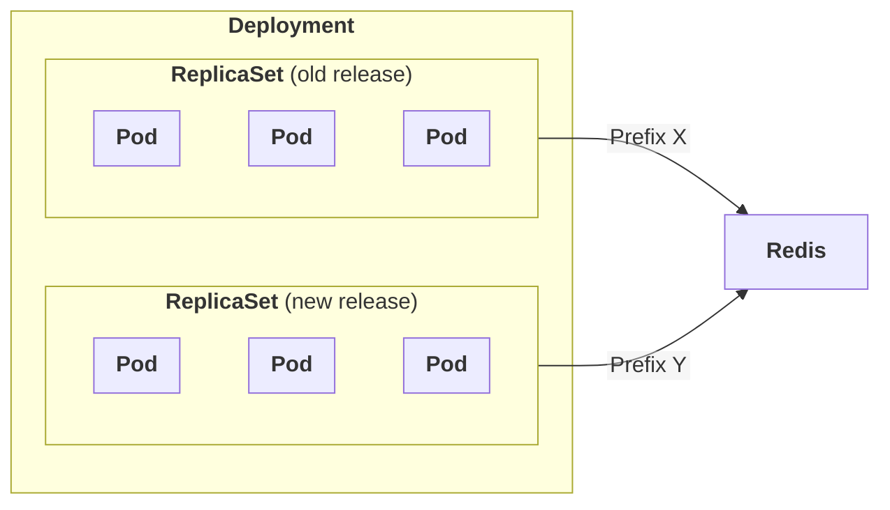
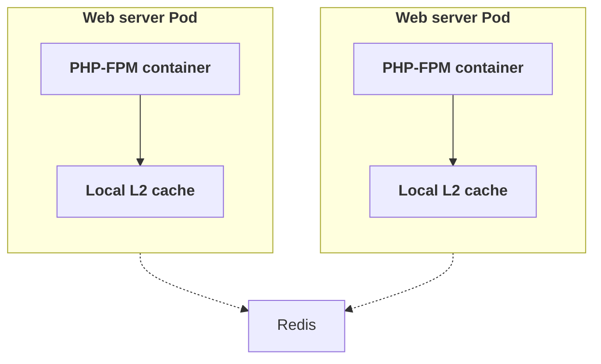
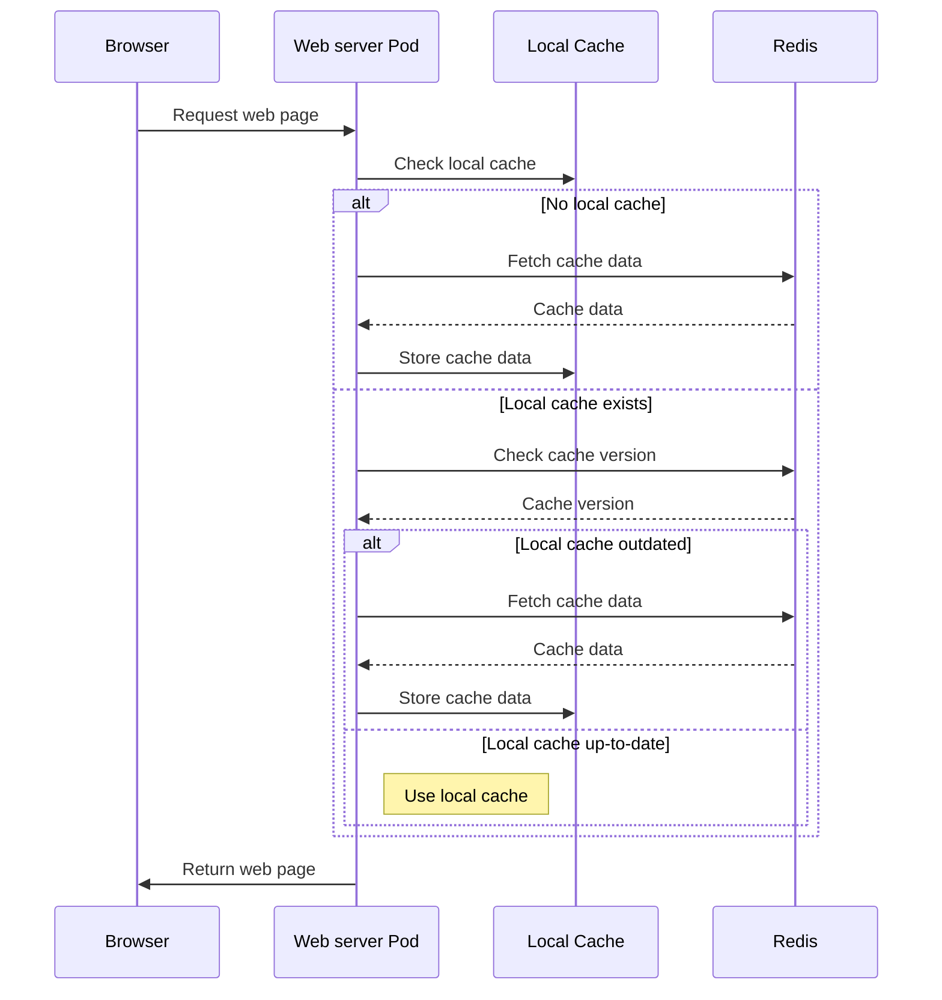

# Configuration

The `app/etc/env.php` configuration file of your project should be fine-tuned for optimal performance and security.

## Admin prefix

The admin URL is the entry point to the Magento Admin. It is important to change the default admin URL to a custom one to prevent unwanted access to the admin panel login screen.

To change the admin URL, update the `backend` configuration:

```php
<?php
return [
    ...
    'backend' => [
        'frontName' => 'admin_123_xyz' // Change this to a custom admin URL
    ],
    ...
];
```

## Cache

Instead of using the default file-based cache, you can use Redis for better performance. To configure Redis, update the `cache` configuration:

::: code-group

```php [env.php]
<?php
return [
    ...
    'cache' => [
        'frontend' => [
            'default' => [
                'id_prefix' => (getenv('MAGENTO_REDIS_PREFIX') ?: 'default') . '_',
                'backend' => \Magento\Framework\Cache\Backend\Redis::class,
                'backend_options' => [
                    'server' => getenv('MAGENTO_REDIS_HOST'),
                    'password' => getenv('MAGENTO_REDIS_PASSWORD') ?: '',
                    'port' => getenv('MAGENTO_REDIS_PORT') ?: '6379',
                    'database' => getenv('MAGENTO_REDIS_DATABASE_DEFAULT') ?: '0',
                    'compress_data' => '',
                    'compress_data' => '1',
                    'compression_lib' => 'gzip',
                ],
            ],
            'page_cache' => [
                'id_prefix' => (getenv('MAGENTO_REDIS_PREFIX') ?: 'fpc') . '_',
                'backend' => \Magento\Framework\Cache\Backend\Redis::class,
                'backend_options' => [
                    'server' => getenv('MAGENTO_REDIS_HOST'),
                    'password' => getenv('MAGENTO_REDIS_PASSWORD') ?: '',
                    'port' => getenv('MAGENTO_REDIS_PORT') ?: '6379',
                    'database' => getenv('MAGENTO_REDIS_DATABASE_FPC') ?: '1',
                    'compress_data' => '1',
                    'compression_lib' => 'gzip',
                ]
            ]
        ],
        'allow_parallel_generation' => false,
    ],
    ...
];
```
:::

### Redis ID Prefix

The `id_prefix` option is used to prefix the cache keys.

This is particularly useful when you deploy a new release of your Magento / Adobe Commerce application in Kubernetes, to avoid cache key conflicts between releases.

Indeed, when releasing a new version of your application, new Pods will progressively replace the old ones, meaning that you will have two versions of your application running at the same time.



In the diagram above, you can see that the old release and the new release of your application are both using the same Redis instance.

If you don't use a prefix, the cache keys generated by the old release and the new release will conflict with each other, leading to unexpected behavior.

> [!IMPORTANT]
> The `id_prefix` value should be unique for each release of your application, using the `MAGENTO_REDIS_PREFIX` environment variable.
> It could for example be the Git commit hash of the release, or the release version.

### L2 Cache

When running multiple instances of your Magento / Adobe Commerce application, each `Pod` will fetch the cache from the Redis server for every request.

This can lead to a high load on the Redis server, network congestion, and increased latency.

To mitigate this, you can use a L2 cache, which is a local cache that stores locally on each `Pod` a copy of the cache data fetched from the Redis server, avoiding fetching the cache data from the Redis server for every request.

To ensure the local cache is always up-to-date, Magento / Adobe Commerce will check the cache version from the Redis server, and only fetch the cache data if the local cache is outdated.



The sequence diagram below illustrates the process of fetching the cache data from the Redis server and storing it in the local cache:


